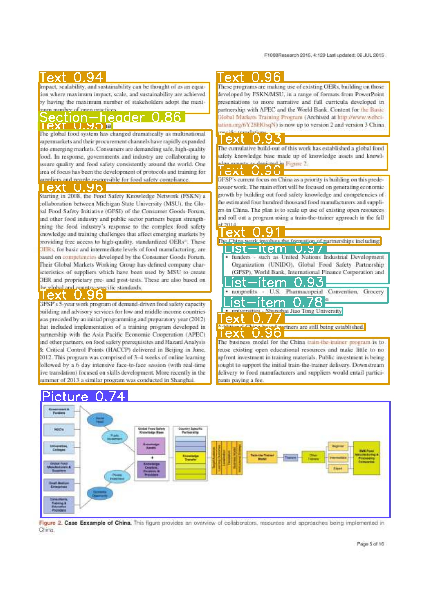

# Object Detection in PDF Documents

This project uses the YOLO (You Only Look Once) model, a state-of-the-art, real-time object detection system, to identify and classify entities in PDF documents. The process involves several steps:

1. **PDF to Image Conversion**: The input PDF document is converted into a series of images. Each page of the PDF becomes a separate image. This is done using the `pdf2image` library.

2. **Object Detection**: Each image is then processed using the YOLO model. The model has been trained to recognize a variety of entities such as captions, footnotes, formulas, headers, text, titles, etc. For each recognized entity, the model generates a bounding box around the entity in the image and assigns a confidence score indicating the model's certainty about the detected entity.

3. **Image Processing**: The bounding boxes and confidence scores generated by the YOLO model are then drawn onto the images for visualization. This gives a clear picture of what entities the model has recognized and where they are located on the page.

4. **Image to PDF Conversion**: Once all images have been processed, they are converted back into a single PDF document. This is done using the `img2pdf` library. The resulting PDF contains the original content of the input PDF, but with the addition of bounding boxes around the detected entities.

This process allows for the automatic detection and classification of various entities in PDF documents, which can be useful in a variety of applications such as document analysis, content extraction, accessibility, and more.

## Prerequisites

- Python 3.6 or later
- Libraries: os, cv2, ultralytics, pdf2image, PIL, numpy, img2pdf

You can install the necessary libraries with pip:

```bash
pip install opencv-python-headless ultralytics pdf2image pillow numpy img2pdf
```

## Usage

1. Place your PDF document in the `documents` folder.
2. Update the `pdfs` variable in the script with the name of your PDF document (without the .pdf extension).
3. Run the script:

```bash
python layoutIdentifier.py
```

The layoutIdentifier will create a new PDF in the `Layout-Identification-output` folder with the same name as the input PDF, but with bounding boxes drawn around the detected objects.

## Model

The object detection is performed using a pretrained YOLO model. The model file should be placed in the `models` folder and its name should be updated in the `models` variable in the script.

## Understanding the Output

The output images will have bounding boxes drawn around the detected objects. Each bounding box is labeled with the class of the detected object and the confidence score of the detection. For example, in the image below:


You can see several bounding boxes labeled with different classes such as 'Table', 'Text', 'Section header', and 'Page-footer', along with their respective confidence scores. The confidence score is a value between 0 and 1 that indicates the model's confidence that the detected object belongs to the specified class. A higher score means the model is more confident.

Please note that the actual output may vary depending on the content of the input PDF and the confidence threshold specified when running the script.

## Other Sample Output

Here are some sample outputs of the script:





## License

This project is licensed under the terms of the MIT license.
